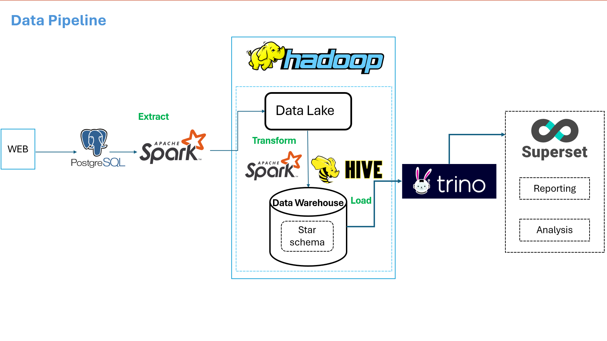
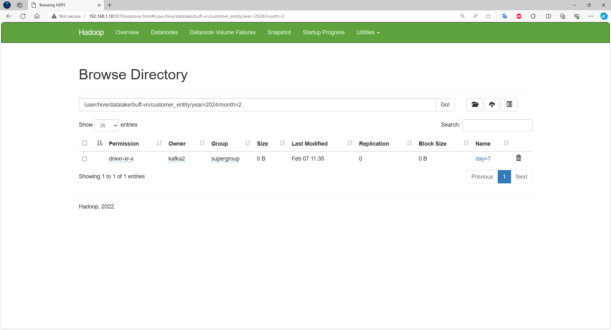
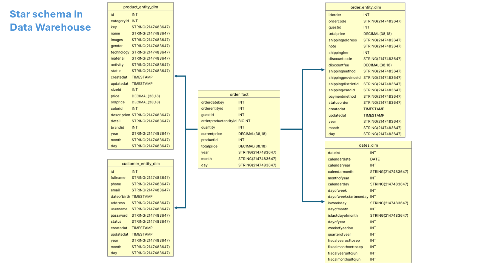
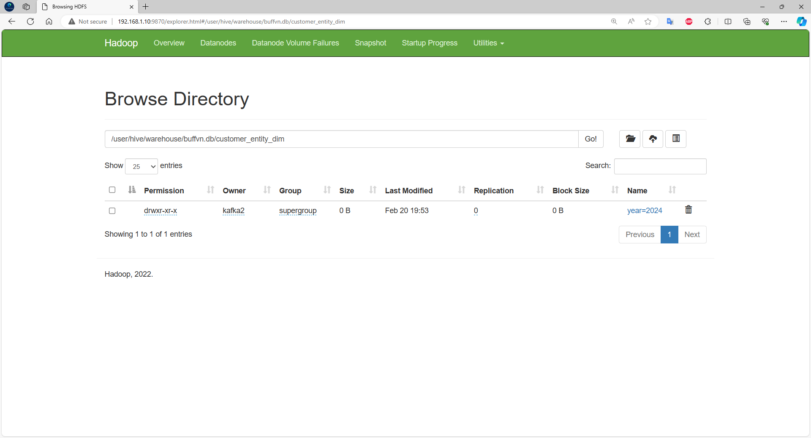
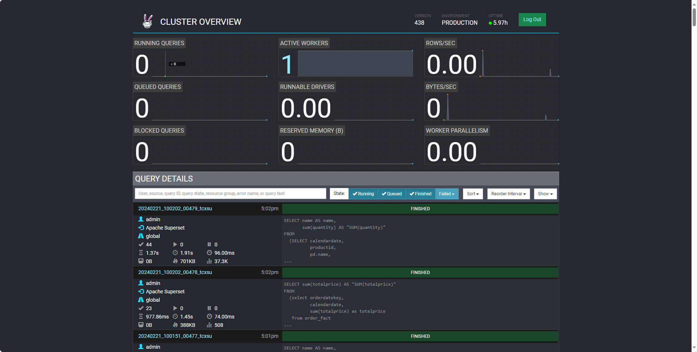

# Order-Management--Data-Warehouse

## About Project

Build data pipeline on premise

This project solves problem OLAP on E-Commerce order management dataset (small dataset)

The aim of this project, is to build data pipeline,data lake, data warehouse,to perform ETL as well as practicing big data tools. To answer questions the business such as :

- Revenue of all orders everyday and in 2022
- Which products do customers buy the most in a day?

**Video Demo**: [Click Here](https://drive.google.com/file/d/1kueWDSmoipsqWWZ8qHNifRgRwWnQf2j_/view?usp=sharing)

## Architecture

## Datalake in HDFS

## Star schema in Data Warehouse
Applying Kimball's Architecture. Create fact table and dimensions table

**Data Warehouse in HDFS**

## Report
### Superset

### Trino

