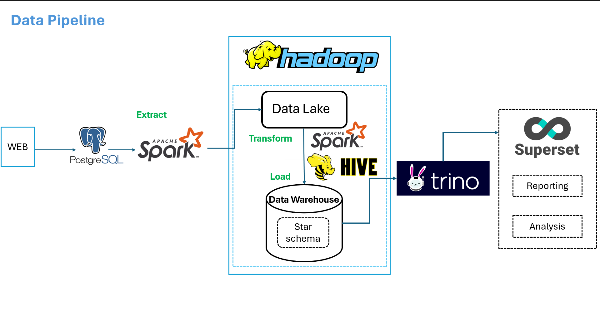

# Order-Management--Data-Warehouse

## About Project

Build data pipeline on premise

This project solves problem OLAP on E-Commerce order management dataset (small dataset)

The aim of this project, is to build data pipeline,data lake, data warehouse,to perform ETL as well as practicing big data tools. To answer questions the business 

**Video Demo**: [Click Here](https://onedrive.live.com/?cid=837D17307B83D72B&id=837D17307B83D72B%21222687&parId=837D17307B83D72B%21222686&o=OneUp)

## Architecture

## Star schema in Data Warehouse
Applying Kimball's Architecture. Create fact table and dimensions table

## Report
### Superset

### Trino

